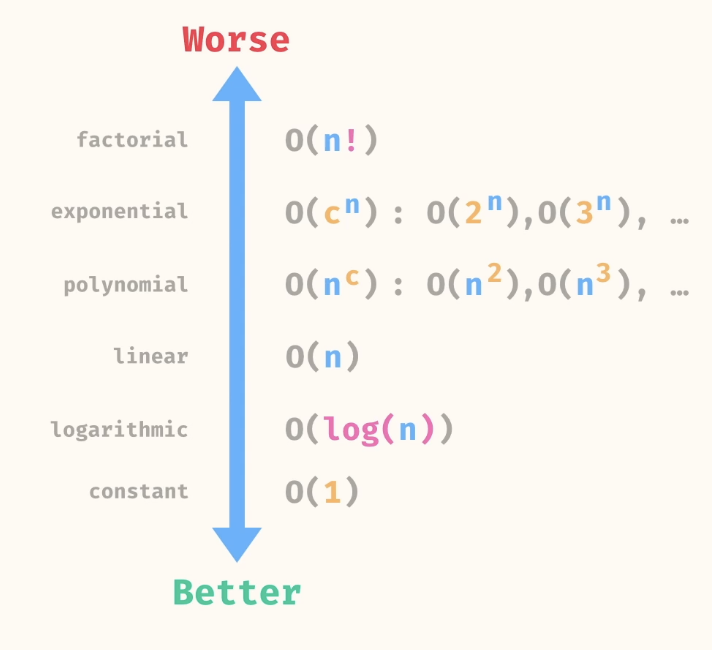

### Notes
What is Big O?
- describes the performance of algorithms
- emphasis on how performance scales with input size
- approximation

Why?
- allows us to compare performance of algorithms
- does not rely upon environment

Big-O Simplification Rules
- drop any constant factors 
	- O(4n) -> O(n)
- drop smaller terms in a sum
	- O(n^2 + n) -> O(n^2)

Simple chart of Big O

